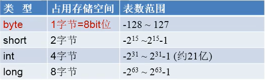
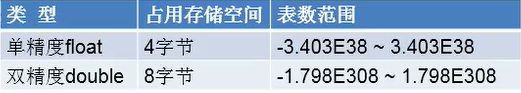

# 基础

## 介绍

* 版本  
    * `JavaEE`: 企业版, 定位在服务端的应用  
    * `JavaSE`: 标准版, 定位在个人计算机上的应用  
    * `JavaME`: 微型版, 定位在消费性电子产品的应用* 编译型语言
    
* `JVM, JRE, JDK`  
    * `JVM`: 执行字节码的虚拟计算机  
    * `JRE`: 包含'JVM', 库函数, 运行java应用程序的文件  
    * `JDK`: 包含`JRE`, 已经增加编译器和调试器等用于程序开发的文件

## 基本语法

### 注释
* 行注释  
  `//`
* 多行注释  
    `/* */`
* 文档注释  
```
  /**
  *
  */
```

### 基本代码块

```java
class HelloWorld {
    public static void main(String[] args) {
        System.out.print("Hello, world!");
    }
}
```

### 关键字

* 被JAVA语言赋予了新的含义, 有专门用处的字符串  
* 关键字都是小写

> int, short, long, byte, 

### 保留字

* 现在java版本还没有使用, 在后面可能会进行使用

### 标识符
* JAVA对各种变量, 方法, 类定义名字所使用的字符  
   * 可以定义名字的都叫标识符  

* 规则  
   * 有26个字母, 0-9数字, _或$组成  
   * 不能以数字开头  
   * 不能使用关键字和保留字  
   * 严格区分大小写  

* 规范  
   * 包名 全部小写  
   * 类名 首字母大写  
   * 变量 驼峰命名  
   * 常量 全部大写, 中间以_来连接  

### 变量
* 概念  
   * 内存中的一个存储区域  
   * 包含变量类型, 变量名, 存储的值  
   * 先声明后使用  

#### 数据类型

##### 基本数据类型

###### 数值型
* 整数
  > byte, short, int, long  

  

* 浮点数
  > float, double  

  
 
* 字符型
  > char

* 布尔型
  > boolean

###### 引用数据类型
* 类(String也是一个类)
* 接口
* 数组

##### 自动类型转化
* 小容量类型会自动转化为大容量类型

##### 强制类型转化
* 将大容量类型强制转化为小容量类型的
  > 在前面加上(type)  
  > 可能会造成精度溢出

### 进制
* 在计算机数据都是以二进制形式存在
   * 二进制 0b  
   * 十进制  
   * 八进制 0  
   * 十六进制 0x  
      > A - 9, B - 10, ... , F - 15

* 二进制在计算机中表现形式
   * 一个字节就是八位, 1 byte = 1 bit, 最高位为符号位  
        > 也就是 1 -> 0000 0001  
        >      -1 -> 1000 0001

### 运算符

* 算术运算符
   * +, -, *, /, %, ++, --

* 赋值运算符
   * =, +=, -=, *=, /=, %=

* 比较运算法
   * ==, !=, <, >, <=, >=, instanceof

* 逻辑运算符
   * &, &&, |, ||

* 位运算符

* 三元运算符 

### 流程控制
* if, else
* switch() { case: }
* 三元表达式

### 循环
* for
* while

## 数组

> 一维数组

  * 引用数据类型, 可以是任何的数据类型
  * 长度一旦确定, 不能被改变

  * 一唯数组的声明方式
     * `type var[]  type[] var`

  * 动态初始化
     * 声明并且分配空间


```java
// 声明
int a[];
int[] a1;
double b[];
String[] c;

// 动态初始化
int[] arr1 = new int[2];

// 静态初始化
int[] arr2 = new int[]{1, 2, 3};
String[] arr4 = {"12", "412"};
```


二维数组

```java
int[][] arr1 = new int[2][4];
int[][] arr2 = new int[][] {{1, 2},{3, 0}};
System.out.println(arr2[0][1]);
```
