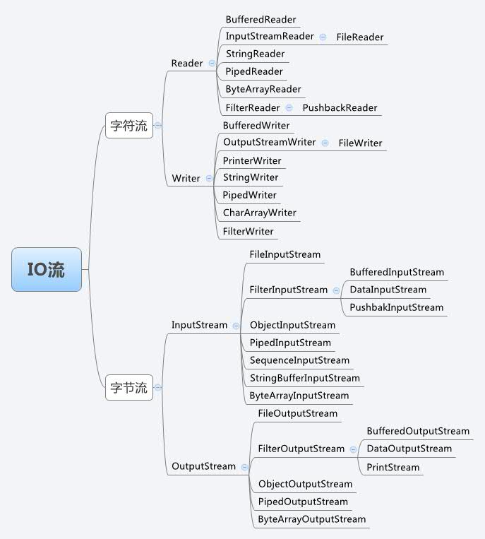

# io与网络编程

## `IO`
> `java.io`

### `java.io.File`
* 文件和文件夹的一些操作, 无法读取内容

### 流

| 抽象基类 | 字节流 |字符流 |
| :- | :- | :- |
| 输入流 | `InputStream` | `Reader` |
| 输出流 | `OutputStream` | `Writer` |


`
* 文件流
* `FileInputStream`
* `FileOutputStream`
* `FileReader`
* `FileWriter`

#### `FileReader`
* `read`方法
```java
package com.wuzu.IO;

import org.junit.Test;

import java.io.File;
import java.io.FileReader;
import java.io.IOException;

/**
 * @author wujianyoujian
 * @create 2021-02-15 13:35
 */
public class StreamTest {
    @Test
    public void test1() {
        // 文件对象
        FileReader fileReader = null;
        try {
            File file = new File("./io/test/2.txt");
            // 文件流
            fileReader = new FileReader(file);
            // 读取流
            int data = fileReader.read();
            while (data != -1) {
                System.out.println(data);
                System.out.println((char) data);
                data = fileReader.read();
            }
        } catch (IOException e) {
            e.printStackTrace();
        } finally {
            try {
                assert fileReader != null;
                fileReader.close();
            } catch (IOException e) {
                e.printStackTrace();
            }
        }
    }
}

```

* 注意char保存的数据的长度
```java
@Test
public void test2() throws IOException {
    File file = new File("./io/test/2.txt");
    FileReader fr = new FileReader(file);
    char[] cbuf = new char[4];
    int len;
    while((len = fr.read(cbuf)) != -1) {
        System.out.print((new String(cbuf, 0, len)));
    }
    fr.close();
}
```

#### `FileWrite`
* `write`
```java
public void test4() throws IOException {
    File file = new File("./io/test/2.txt");
    // 添加原有文件
    FileWriter fileWriter = new FileWriter(file, true);
    fileWriter.write("I have a dream");
    fileWriter.close();
}
```
* 复制

```java
@Test
public void test1() throws FileNotFoundException {
    FileInputStream fileInputStream = null;
    FileOutputStream fileOutputStream = null;
    try {
        File file = new File("./io/uni.png");
        File file1 = new File("./io/uni1.png");
        fileInputStream = new FileInputStream(file);
        fileOutputStream = new FileOutputStream(file1);
        byte[] buffer = new byte[10];
        int len;
        while ((len = fileInputStream.read(buffer)) != -1) {
//                System.out.print(new String(buffer, 0, len));
            fileOutputStream.write(buffer, 0, len);
        }
    } catch (IOException e) {
        e.printStackTrace();
    } finally {
        try {
            assert fileInputStream!= null;
            fileInputStream.close();
        } catch (IOException e) {
            e.printStackTrace();
        }
        try {
            assert fileOutputStream != null;
            fileOutputStream.close();
        } catch (IOException e) {
            e.printStackTrace();
        }
    }
}
```

#### `BufferedRead`
* 先关闭外部流再关闭内部流
#### `BufferedWrite`
#### `BuffereInPutStream`
#### `BuffereOutPutStream`

### 转换流
#### `InputSreamReadder`
* 将字节的输入流转换为字符(`char`)的输入流
#### `OutputStreamWrite`
* 将字符的输出流转换为字节(`byte`)的输出流

### 对象流
* 序列化
  * `ObjectInputStream`
* 反序列化
  * `ObjectOutStream`

```java
package com.wuzu.IO;

import org.junit.Test;

import java.io.*;

/**
 * @author wujianyoujian
 * @create 2021-02-17 9:21
 */
public class ObjectInputOutStreamTest {
    @Test
    public void test1() {
        ObjectInputStream objectInputStream = null;
        try {
            objectInputStream = new ObjectInputStream(new FileInputStream("./io/test/2.dat"));
            try {
                String msg = (String) objectInputStream.readObject();
                System.out.println(msg);
            } catch (ClassNotFoundException e) {
                e.printStackTrace();
            }
        } catch (IOException e) {
            e.printStackTrace();
        } finally {
            try {
                assert objectInputStream != null;
                objectInputStream.close();
            } catch (IOException e) {
                e.printStackTrace();
            }

        }
    }

    @Test
    public void test2() {
        ObjectOutputStream objectOutputStream = null;
        try {
            objectOutputStream = new ObjectOutputStream(new FileOutputStream("./io/test/2.dat"));
            objectOutputStream.writeObject("好久不见");
        } catch (IOException e) {
            e.printStackTrace();
        } finally {
            try {
                assert objectOutputStream != null;
                objectOutputStream.close();
            } catch (IOException e) {
                e.printStackTrace();
            }
        }
    }
}

```

* 如果自定义对象支持序列化, 需要实现标识接口`serializable`,`externalizable` 以及显示声明`serialVersionUID` 长整数型常量
* 类内部属性也是可序列化的

```java
package com.wuzu.IO;

import java.io.Serializable;

/**
 * @author wujianyoujian
 * @create 2021-02-17 9:48
 */
public class Person implements Serializable {
    String name;
    int age;
    private static final long serialVersionUID = 1314413222222222222L;

    Person() {
    }

    Person(String name, int age) {
        this.name = name;
        this.age = age;
    }

    public String getName() {
        return name;
    }

    public void setName(String name) {
        this.name = name;
    }

    public int getAge() {
        return age;
    }

    public void setAge(int age) {
        this.age = age;
    }

    @Override
    public String toString() {
        return "Person{" +
                "name='" + name + '\'' +
                ", age=" + age +
                '}';
    }
}

```

## 网络

### TCP
```java
package com.wuzu.网络;

import org.junit.Test;

import java.io.ByteArrayOutputStream;
import java.io.IOException;
import java.io.InputStream;
import java.io.OutputStream;
import java.net.ServerSocket;
import java.net.Socket;

/**
 * @author wujianyoujian
 * @create 2021-02-17 10:57
 */
public class TcpTest {
    @Test
    public void test1() {
        Socket socket = null;
        OutputStream os = null;
        try {
            socket = new Socket("127.0.0.1", 8899);
            os = socket.getOutputStream();
            os.write("你好, 我是Hero".getBytes());
            // 停止发送
            socket.shutdownOutput();
        } catch (IOException e) {
            e.printStackTrace();
        } finally {
            try {
                assert socket != null;
                socket.close();
            } catch (IOException e) {
                e.printStackTrace();
            }
            try {
                assert os != null;
                os.close();
            } catch (IOException e) {
                e.printStackTrace();
            }
        }

    }

    @Test
    public void test2() {
        ServerSocket server = null;
        Socket socket = null;
        InputStream inputStream = null;
        ByteArrayOutputStream baos = null;
        try {
            server = new ServerSocket(8899);
            socket = server.accept();
            inputStream = socket.getInputStream();
            baos = new ByteArrayOutputStream();
            byte[] cbuf = new byte[5];
            int len;
            while((len = inputStream.read(cbuf)) != -1) {
                baos.write(cbuf, 0, len);
            }
            System.out.println(baos.toString());
        } catch (IOException e) {
            e.printStackTrace();
        } finally {
            try {
                assert socket != null;
                socket.close();
            } catch (IOException e) {
                e.printStackTrace();
            }
            try {
                assert baos != null;
                baos.close();
            } catch (IOException e) {
                e.printStackTrace();
            }
            try {
                inputStream.close();
            } catch (IOException e) {
                e.printStackTrace();
            }
        }
//        byte[] cbuf = new byte[36];
//        int len;
//        while((len = inputStream.read(cbuf)) != -1) {
//            String msg = new String(cbuf, 0, len);
//            System.out.println(msg);
//        }
    }
}

### UDP
```java
// 服务端
DatagramSocket ds = null;
try {
    ds = new DatagramSocket();
    byte[] by = "hello,atguigu.com".getBytes();
    DatagramPacket dp = new DatagramPacket(by, 0, by.length, 
    InetAddress.getByName("127.0.0.1"), 10000);
    ds.send(dp);
} catch (Exception e) {
    e.printStackTrace();
} finally {
    if (ds != null)
        ds.close();
}

// 接收端
DatagramSocket ds = null;
try {
    ds = new DatagramSocket(10000);
    byte[] by = new byte[1024];
    DatagramPacket dp = new DatagramPacket(by, by.length);
    ds.receive(dp);
    String str = new String(dp.getData(), 0, dp.getLength());
    System.out.println(str + "--" + dp.getAddress());
} catch (Exception e) {
    e.printStackTrace();
} finally {
    if (ds != null)
        ds.close();
}
```

### `URL`
```java
URL url = new URL("http://localhost:8080/examples/text.txt?name=1212");
System.out.println(url.getProtocol());
System.out.println(url.getHost());
System.out.println(url.getPath());
System.out.println(url.getPort());
System.out.println(url.getFile());
System.out.println(url.getQuery());
```